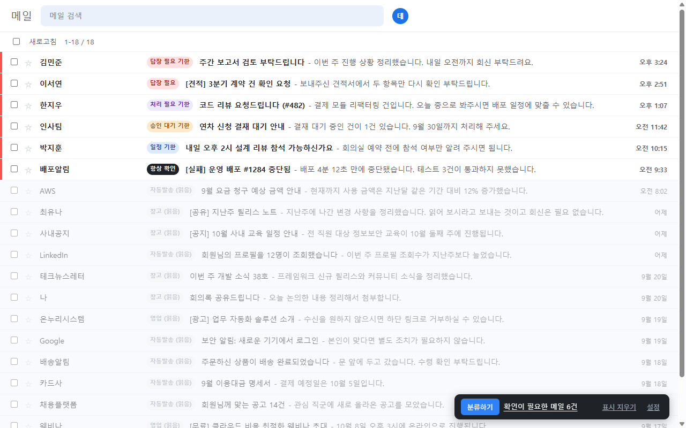
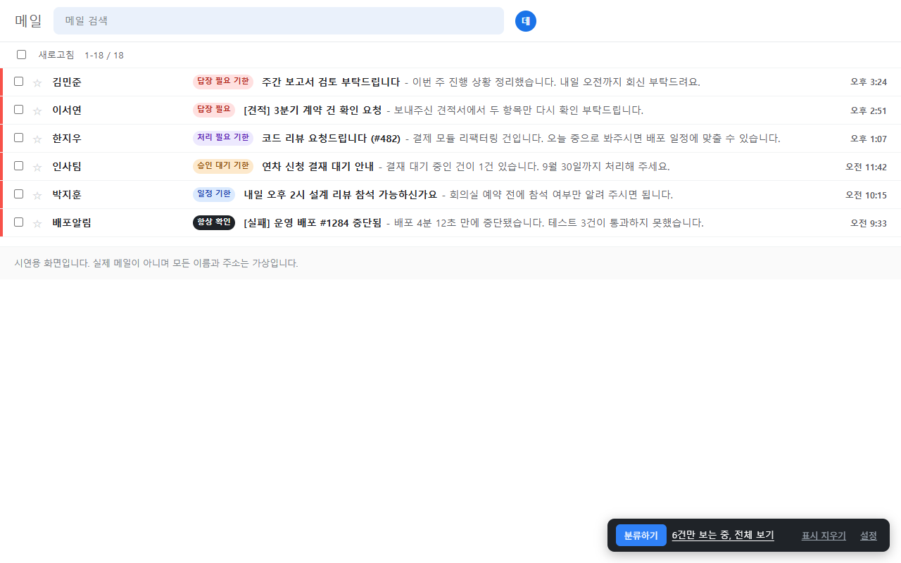
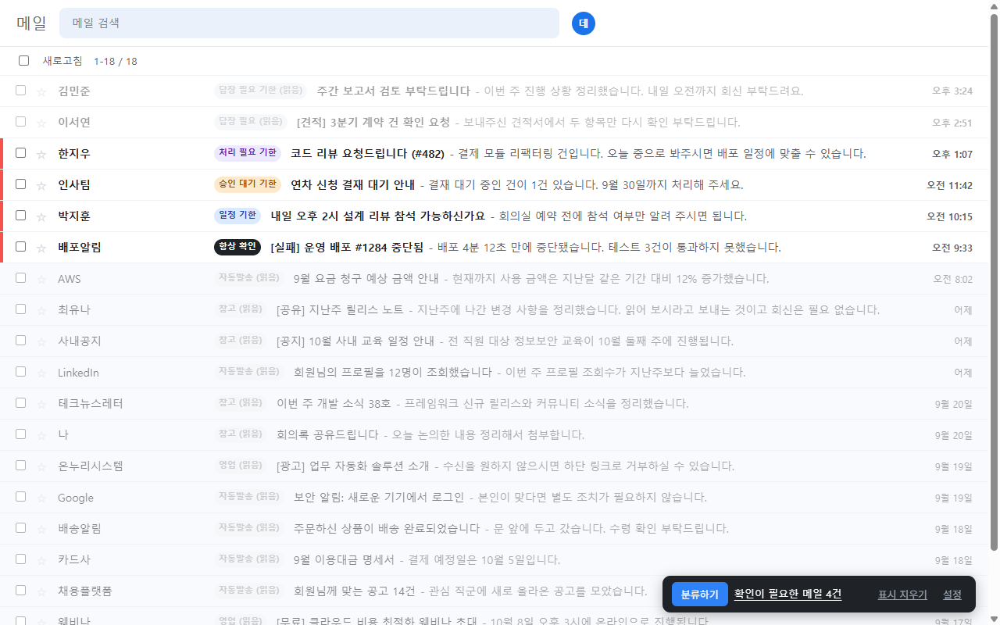

# 메일 분류기 (Mail Triage)

받은 메일 중 **내가 답해야 할 것만** 골라 표시하는 크롬 확장입니다. 광고와 자동발송은 흐리게 처리합니다.

메일을 옮기거나 지우거나 읽음 처리하지 않습니다. 화면에 표시만 덧붙입니다.



화면은 시연용 가짜 메일함입니다. 이름과 주소는 모두 가상입니다.

| 지원 | 확인일 |
|---|---|
| Gmail (개인, Workspace) | 2026-09-22 |
| 네이버 메일 | 2026-09-22 |
| 네이버웍스 | 2026-09-22 |

언어는 한국어와 영어입니다. 그 외 언어 환경에서는 영어로 표시됩니다.

## 어떻게 동작하나

판정은 메일함 오른쪽 아래 패널에서 **분류하기** 를 누를 때만 나갑니다. 저절로 실행되는 일이 없습니다.

1. 화면의 메일 목록에서 제목과 발신자를 읽습니다.
2. 회신 불가 주소(`noreply@` 계열)와 본인이 보낸 메일은 **호출 없이** 바로 처리합니다.
3. 남은 메일만 판정 모델(TypeSafe Jev)에 보냅니다. 한 메일에 세 가지를 **한 번의 호출로** 묻습니다.

| 질문 | 내용 |
|---|---|
| 행동 필요 | 받는 사람의 답변이나 행동을 기다리는가 |
| 유형 | 답장 필요 / 처리 필요 / 승인 대기 / 일정 / 참고 / 영업 / 자동발송 / 내가 보냄 / 기타 |
| 기한 | 정해진 시점까지 해야 할 일이 있는가 |

화면에는 **판정 하나만** 나옵니다.

| 보이는 것 | 뜻 |
|---|---|
| 빨간 띠 + `항상 확인` | 설정에서 직접 지정한 발신자나 제목 단어 |
| 빨간 띠 + `멘션` | 본문에서 나를 멘션한 메일(네이버웍스) |
| 빨간 띠 + `답장 필요` `처리 필요` `승인 대기` `일정` | 확인 필요 |
| 띠 없이 흐림 + `참고` `영업` `자동발송` `내가 보냄` `무시함` (회색) | 확인 불필요 |
| 아무 표시 없음 | 아직 분류하지 않음 |

배지 뒤의 `(읽음)` 은 이미 읽은 메일이라는 뜻입니다.

배지에 마우스를 올리면 무엇으로 정해졌는지가 보입니다. 모델이 판정한 메일은 행동 필요 확률과 유형 확신이, 규칙으로 정해진 메일은 어느 규칙에 걸렸는지가 나옵니다. 항상 확인이나 항상 무시에 걸렸으면 걸린 줄 가운데 가장 긴 것이 나옵니다. 그 줄을 지워도 같은 목록의 다른 줄이나 뒤의 규칙에 걸리면 표시는 그대로이고, 바꾼 설정은 분류하기를 다시 눌러야 반영됩니다.

종류와 행동 필요는 내부적으로 별개 질문이지만 화면에서는 합칩니다. 종류가 답장 필요여도 그 일이 받는 사람 몫이 아니면 강조하지 않고, 그때는 배지도 `참고` 로 내려갑니다. 두 답을 그대로 내보내면 같은 배지가 어떤 행에서는 강조되고 어떤 행에서는 아닌 화면이 되기 때문입니다. 원래 분류는 배지에 마우스를 올리면 보입니다.

판정한 메일은 캐시되므로 다시 눌러도 비용이 들지 않습니다.

### 판정 기준

판정 모델은 TypeSafe 의 Jev 입니다. 메일마다 아래 입력을 받아 확률이나 정해진 선택지로만 답합니다. 글로 된 답을 내지 않으므로, 메일 안에 지시문이 섞여 있어도 확장이 그 지시를 따르는 일은 없습니다. 다만 그 메일 한 건의 판정은 흔들릴 수 있습니다.

| 모델에 주는 것 | 모델이 돌려주는 것 |
|---|---|
| 역할 문장, 본인 이름과 주소(설정한 경우), 발신자 이름과 주소, 제목, 목록 미리보기(최대 500자) | 행동 필요 확률(0~1), 유형 하나, 기한 확률(0~1) |

읽음 여부는 넣지 않습니다. 같은 메일이 읽었는지에 따라 다르게 판정되면 안 되기 때문입니다.

제목이 `RE:` 나 `회신:` 으로 시작하면, 제목의 요청은 원래 메일을 보낸 사람의 것일 수 있다는 안내를 함께 넣습니다. 회신 제목은 원래 메일의 요청을 그대로 달고 오므로, 이 안내가 없으면 내가 보낸 요청에 상대가 답한 메일이나 참조로 받은 남의 회신도 답장 필요로 보입니다.

표시는 아래 순서로 정합니다. 앞에서 정해지면 뒤는 보지 않으므로, 모델은 마지막에만 부릅니다.

1. 확인 목록에서 열어 본 메일: 원래 유형에 `(읽음)` 을 붙입니다
2. 본인이 보낸 메일: 흐림과 `내가 보냄`. 제목에 항상 확인의 말이 있어도 내가 처리할 일은 아니라 목록보다 앞섭니다
3. 항상 확인에 걸린 메일: 빨간 띠와 `항상 확인`
4. 항상 무시에 걸린 메일: 흐림과 `무시함`
5. 본문에서 나를 멘션한 메일: 빨간 띠와 `멘션`. 보낸 사람이 나를 골라 부른 것이라 확률에 맡기지 않습니다. 목록에 멘션 표시가 있는 네이버웍스에만 적용됩니다
6. 회신 불가 주소(`noreply@` 계열): 흐림과 `자동발송`
7. 전에 판정한 메일: 저장된 판정을 그대로 씁니다
8. 나머지: 모델에 묻습니다

모델의 답은 이렇게 화면이 됩니다.

| 모델의 답 | 화면 |
|---|---|
| 행동 필요 확률이 문턱 이상 | 빨간 띠. 문턱은 설정의 강조 강도로 고릅니다(0.5, 기본 0.7, 0.85) |
| 강조된 메일의 기한 확률이 0.7 이상 | 배지에 `기한` 이 붙습니다 |
| 문턱 아래 | 흐림. 유형이 답장 필요처럼 행동을 뜻하는 것이면 `참고` 로 내려 보입니다 |
| 문턱 이상이지만 받는 사람 칸에 내가 없고 멘션도 없음 | 흐림과 `참조`. 참조, 숨은 참조, 단체 주소로 받은 메일의 요청은 대개 받는 사람 칸의 사람 몫이기 때문입니다. 원래 분류와 확률은 툴팁에 남고, 항상 확인에 걸린 메일과 나를 멘션한 메일은 그대로 강조합니다. 목록에 받는 사람 표시가 있는 네이버웍스에만 적용됩니다 |

### 확인할 것만 보기

판정이 끝나면 패널에 **확인이 필요한 메일 N건** 이 나옵니다. 그 문장을 누르면 빨간 띠만 남기고 나머지가 접힙니다. 다시 누르면 전체가 돌아옵니다.



메일을 열었다 돌아와도 접힌 상태가 이어집니다. 남은 메일을 차례로 열어 가며 줄여 나갈 수 있습니다. 판정하지 않은 메일은 접지 않고, 그런 메일만 있는 페이지로 넘어가면 접을 것이 없으므로 풀립니다.

화면에서만 감추는 것이라 메일에는 아무 일도 일어나지 않고, 페이지를 새로고침하면 그대로 돌아옵니다.

### 처리한 메일 내리기

**강조된 메일을 열면 확인 목록에서 내려갑니다.** 여는 것이 이미 처리한다는 뜻이므로 따로 눌러 알릴 필요가 없습니다. 빨간 띠였다면 패널의 숫자가 하나 줄고, 다음에 분류할 때는 호출 없이 건너뜁니다.



흐린 메일과 자동발송은 애초에 확인 목록에 없으므로 열어도 달라지는 것이 없습니다.

배지에는 원래 유형과 함께 상태가 남습니다. `답장 필요` 였다면 `답장 필요 (읽음)` 이 됩니다. 확장이 아는 것은 메일을 열었다는 사실뿐이고 답장을 보냈는지는 알 수 없으므로, 처리했다고 적지 않습니다.

열었지만 아직 답하지 않았다면 그 배지를 눌러 다시 올릴 수 있습니다. 열지 않고 배지만 눌러 내릴 수도 있습니다.

전체를 되돌리려면 설정의 문제 해결에서 **기록 비우기** 를 누릅니다. 기록은 60일이 지나면 저절로 지워집니다.

### 메일을 열었다 돌아오거나 페이지를 넘겼을 때

메일 서비스가 목록을 새로 그립니다. 확장이 이를 알아채고 **이미 판정해 둔 것만 다시 붙입니다.** 새 호출이 나가지 않으므로 비용이 들지 않고, 판정이 없는 메일은 건드리지 않습니다.

목록이 행을 재사용해 다른 메일이 들어오면 남은 표시를 걷어 냅니다. 분류하는 도중에 페이지를 넘겨도 판정은 그 메일에만 붙고, 그 페이지로 돌아오면 나타납니다.

설정에서 판정이나 내려간 기록을 비우면 이미 열린 메일 탭도 따릅니다.

## 설치

1. 이 저장소를 내려받습니다.
2. 크롬 주소창에 `chrome://extensions` 를 엽니다.
3. 오른쪽 위 **개발자 모드** 를 켭니다.
4. **압축해제된 확장 프로그램을 로드합니다** 를 누르고 이 폴더를 고릅니다.

## 설정

**1. 내 역할과 관심사.** 유일한 필수 항목입니다. 직군을 고르면 문장이 채워지고, 고쳐 쓸 수 있습니다.

**2. 판정 방식.** 둘 중 하나를 고릅니다. 언제든 바꿀 수 있습니다.

| 방식 | 키 | 요청이 지나는 곳 | 한도 |
|---|---|---|---|
| 무료 체험 | 필요 없음 | 개발자 서버를 한 번 | 하루 한도 있음 |
| 내 API 키 | `console.typesafe.ai` 에서 발급 | **개발자를 거치지 않음** | 없음 |

체험에 서버가 끼는 이유는 하나입니다. **개발자 키를 확장 안에 넣으면 설치한 사람이 소스에서 그대로 꺼내 쓸 수 있기 때문입니다.** 그래서 키는 서버에만 두고 그 서버가 대신 요청을 보냅니다. 내용을 저장하거나 기록하지 않고 그대로 넘깁니다.

다만 **그 약속을 외부에서 확인할 방법은 없습니다.** 업무 메일 제목에는 고객사명과 계약 건명이 들어 있는 경우가 많으니, 그런 계정이라면 **본인 키** 를 쓰시는 편이 낫습니다. 그때는 확장이 판정 서비스로 바로 연결되고 개발자를 아예 거치지 않습니다.

```
예: 서버 개발자. 직접 답하거나 처리하는 것: 코드 리뷰 요청, API 연동 문의, 장애 원인 문의, 배포 일정 조율. 읽기만 하는 것: 요청 없이 알리기만 하는 사내 공지, 다른 팀의 배포 공유, 기술 뉴스레터와 행사 안내, 광고.
```

직군 예시는 모두 이 세 부분(직무, 직접 답하거나 처리하는 것, 읽기만 하는 것)으로 되어 있습니다. 고쳐 쓸 때도 이 틀을 지키면 됩니다.

이 문장은 판정할 때마다 함께 보내는 참고 정보입니다. 모델은 이전 호출을 기억하지 않아 매 건마다 이 문장을 함께 받습니다. **읽기만 하는 것에 적은 종류는 덜 강조되는 쪽으로 판정이 움직입니다.** 다만 공지를 적으면 교육 수강 안내처럼 할 일이 담긴 공지도 함께 내려갈 수 있고, "요청 없이 알리기만 하는 공지"처럼 좁혀 적어도 마찬가지입니다. 놓치면 안 되는 공지는 항상 확인 목록에 제목 단어를 적습니다. 반대로 직접 처리하는 것에 적은 일을 강조로 끌어올리는 힘은 약합니다. 행동 필요 판정은 메일에 질문이나 요청이나 기한 같은 표현이 있는지를 보기 때문입니다. 꼭 봐야 하는 발신자와 제목 단어는 아래 항상 확인 목록에 적는 편이 확실합니다.

역할이 비어 있으면 실행하지 않습니다. 읽기만 할 메일의 종류를 모델에 알리는 자리가 이 문장이기 때문입니다.

특정 발신자를 늘 흐리게 하고 싶으면 역할 문장에 적기보다 아래 항상 무시 목록에 적는 편이 확실합니다. 판정하지 않으므로 호출 비용도 줄어듭니다.

회신 불가 주소에서 오는 알림(배포 실패, 비용 알림 같은 것)은 모델에 묻지 않고 흐리므로 역할 문장에 적어도 쓰이지 않습니다. 꼭 봐야 하는 알림은 항상 확인 목록에 적습니다.

### 항상 확인할 것, 항상 무시할 것

확실히 아는 것은 판정에 맡기지 않습니다. 이 목록이 **모델 판정보다 앞섭니다.**

```
ceo@example.com      특정 발신자
@partner.co.kr       그 회사 전체
deploy-bot           발신 계정의 일부
웨비나                제목에 든 말
```

**발신자와 제목을 함께 봅니다.** 보내는 곳이 매번 달라 발신자로 가를 수 없는 것이 있기 때문입니다. 웨비나 초대나 프로모션이 그렇고, 반대로 특정 프로젝트 이름이 든 메일은 누가 보내든 봐야 합니다.

한 줄에 하나씩 적고, 들어 있기만 하면 맞는 것으로 봅니다. 두 목록에 같이 걸리면 **더 구체적으로 적은 쪽이 이깁니다.** 프로모션을 전부 무시하면서 그중 한 종류만 보는 식으로 쓸 수 있습니다.

**자동 발송 주소도 여기 적으면 강조됩니다.** 배포 실패나 결제 실패 알림처럼 회신할 수 없는 주소에서 오지만 반드시 봐야 하는 것이 있습니다. 반대로 항상 무시할 사람에 적으면 호출 없이 넘어가므로 비용도 줄어듭니다.

**내가 보낸 메일은 목록보다 앞섭니다.** 받은 메일과 보낸 메일이 함께 보이는 목록에서도, 내가 보낸 메일은 제목에 적은 말이 있어도 `내가 보냄` 으로 흐립니다. 다만 상대가 보낸 회신(`RE:`)은 원래 제목을 달고 오므로 목록에 걸립니다.

**직군을 고르면 추천 단어가 나옵니다.** 역할 문장의 첫 문장(직무)이 직군 예시와 같으면, 항상 확인 칸 아래에 그 직군에 권하는 단어가 이유와 함께 나옵니다. 역할 문장으로는 살리기 어려운 메일, 곧 회신 불가 주소에서 오는 알림, 참조나 단체 주소로 받는 요청, 요청 문장 없이 오는 통보를 골랐고, 그 직군이 보내는 쪽보다 받는 쪽인 말을 넣었습니다. 권할 말이 없는 직군에는 나오지 않습니다. **추가를 누른 단어만** 칸에 들어가고, 누르는 순간 저장됩니다. 저절로 넣지 않는 이유는 직군을 보고 고른 예시라 메일함에 따라 맞지 않을 수 있기 때문입니다. 대소문자는 가리지 않지만 띄어쓰기는 같아야 걸리므로, 실제 메일 제목에 맞춰 고쳐 적습니다.

### 어디를 바꾸면 무엇이 달라지나

표시는 확인 목록에서 열어 본 기록, 본인 발신, 항상 확인과 항상 무시, 멘션, 회신 불가 주소, 모델 판정 순으로 정해지고, 앞에서 정해지면 뒤는 보지 않습니다. 그래서 **확실히 정하고 싶은 것은 목록에 적는 것이 가장 강합니다.** 역할 문장은 모델 판정에만 영향을 줍니다.

| 하고 싶은 것 | 어디에 | 적는 예 | 달라지는 것 | 다시 호출되나 |
|---|---|---|---|---|
| 특정 사람이나 회사의 메일을 늘 강조 | 항상 확인 | `ceo@example.com`, `@partner.co.kr` | 빨간 띠와 `항상 확인`. 모델 판정, 회신 불가 주소, 참조로 받은 메일의 규칙보다 앞섭니다. 내가 보낸 메일은 강조하지 않습니다 | 아니오 |
| 제목에 특정 말이 든 메일을 늘 강조 | 항상 확인 | `긴급`, `정산 마감` | 위와 같습니다. 보내는 사람이 매번 달라도 걸립니다 | 아니오 |
| 꼭 봐야 하는 자동 알림 살리기 | 항상 확인 | `deploy-bot`, `Failed pipeline` | 회신 불가 주소에서 와도 강조합니다 | 아니오 |
| 직군에 권하는 단어로 강조 | 항상 확인 칸 아래의 추천 단어 | 개발 팀 리드면 `Failed pipeline`, `긴급`, `담당자 선정`, `정산 마감` | 추가를 누른 단어만 항상 확인에 들어가고 바로 저장됩니다. 그 뒤는 위의 항상 확인과 같습니다. 이유를 보고 내 메일함에 맞는 것만 고릅니다 | 아니오 |
| 광고나 소식지를 판정 없이 흐리게 | 항상 무시 | `newsletter@`, `웨비나` | 흐림과 `무시함`. 호출하지 않아 비용이 줄고, 나를 멘션한 메일도 흐립니다 | 아니오 |
| 공지나 뉴스레터를 덜 강조 | 역할 문장의 읽기만 하는 것 | `요청 없이 알리기만 하는 사내 공지, 뉴스레터와 행사 안내` | 그런 종류의 행동 필요 확률이 내려가 덜 강조되는 쪽으로 움직입니다. 할 일이 담긴 공지도 함께 내려갈 수 있으니 놓치면 안 되는 공지는 항상 확인에 제목 단어를 적습니다. 흐린 배지가 `참고` 로 바뀌기도 합니다 | 예 |
| 내가 챙길 일을 더 강조 | 역할 문장이 아니라 항상 확인 | 그 일의 발신자나 제목 단어 | 역할 문장에 적어도 강조로 끌어올리는 힘은 약합니다. 확실히 올리려면 목록에 적습니다 | 아니오 |
| 내가 보낸 메일 가르기 | 설정 아래쪽의 내 이름과 주소 | `홍길동, gildong@example.com` | 보통은 화면에서 자동으로 찾습니다. 못 찾을 때 적으면 `내가 보냄` 으로 흐립니다. 항상 확인보다 앞서므로, 남의 메일이 `내가 보냄` 으로 흐려지면 목록이 아니라 이 칸을 고칩니다. 판정 입력이기도 해서 캐시 키가 바뀝니다 | 예 |
| 강조를 넓게 또는 좁게 | 강조 강도 | 세 단계 중 하나 | 문턱이 0.5, 0.7, 0.85 로 바뀝니다. 저장된 확률을 새 문턱과 다시 비교합니다 | 아니오 |
| 읽은 메일은 건너뛰기 | 읽지 않은 메일만 분류 | 체크 | 읽은 메일은 판정하지 않고 표시도 붙이지 않습니다 | 아니오 |

**빼거나 되돌릴 때**

- 목록에서 줄을 빼면 그 메일은 목록 규칙을 벗어나 다음 규칙을 따릅니다. 전에 판정한 적이 있으면 저장된 판정을 쓰고, 없으면 다음 분류 때 판정합니다.
- 역할 문장에서 읽기만 하는 종류를 빼면 그 종류가 다시 강조될 수 있습니다. 역할 문장이 바뀌므로 다음 분류 때 다시 판정합니다.

**설정 없이 정해지는 것**

| 경우 | 화면 | 바꾸려면 |
|---|---|---|
| 본문에서 나를 멘션한 메일(네이버웍스) | 빨간 띠와 `멘션` | 항상 무시에 적으면 흐립니다 |
| 회신 불가 주소(`noreply@` 계열)에서 온 메일 | 판정 없이 흐림과 `자동발송` | 항상 확인에 적으면 강조합니다 |
| 받는 사람 칸에 내가 없는 메일(네이버웍스) | 행동 필요 확률이 문턱을 넘어도 흐림과 `참조` | 항상 확인에 적으면 강조합니다 |
| 제목이 `RE:` 나 `회신:` 으로 시작하는 메일 | 제목의 요청이 원래 보낸 사람의 것일 수 있다는 안내를 붙여 판정하므로 덜 강조되기 쉽습니다 | 항상 확인에 적으면 강조합니다 |

**설정을 바꿀 때 판정을 따로 비울 필요는 없습니다.** 판정 입력으로 보내는 역할 문장과 내 이름과 주소만 캐시 키에 들어가고, 나머지는 저장된 판정보다 먼저 적용되거나 저장된 값을 다시 비교합니다. 어느 쪽이든 **분류하기를 다시 눌러야** 화면이 바뀝니다. 저절로 돌지 않습니다.

### 강조 강도

세 단계 중 고릅니다. 기본값은 가운데이고, 몇 주 써 보고 바꾸셔도 됩니다.

| 선택 | 동작 |
|---|---|
| 중요한 메일을 놓치는 것이 더 불편하다 | 경계에 걸친 것도 강조합니다. 헛걸림이 늘어납니다 |
| 둘 다 비슷하다 (권장) | |
| 안 중요한 게 강조되는 것이 더 불편하다 | 분명한 것만 강조합니다. 놓치는 메일이 생길 수 있습니다 |

판정 확신도는 과제마다 실제 정확도가 다릅니다. 공개된 제3자 측정에서 같은 확신도 구간이라도 과제에 따라 실제 정확도가 81%에서 99%까지 갈렸습니다. 메일함마다 발신자 구성이 다르므로 본인 데이터에서 정하는 것이 맞습니다.

자료는 저절로 모입니다. **빨간 띠가 안 붙었는데 실제로는 답해야 했던 메일** 이 몇 건인지 세면 그것이 강도를 올릴 근거입니다.

## 직접 중계를 운영하려면

`src/config.js` 의 중계 주소가 비어 있으면 체험을 고를 수 없고 본인 키로만 동작합니다.

중계를 두려면 Cloudflare Workers 같은 곳에 프록시를 올리고 그 주소를 `src/config.js` 와 `manifest.json` 의 `host_permissions` 에 넣습니다. **키는 그 서버의 비밀 값으로만 두고 확장에는 넣지 마십시오.** 확장에 들어간 키는 설치한 사람이 소스에서 그대로 읽습니다.

이 저장소를 포크해 배포할 때는 `src/config.js` 의 중계 주소를 자기 것으로 바꾸거나 비워 두십시오. 그대로 두면 체험 요청이 원래 개발자의 중계로 가고, 그 중계는 등록된 확장의 요청만 받도록 바뀔 수 있습니다.

## 비용

무료 체험에서는 개발자가 냅니다. 내 API 키를 쓰면 아래 비용이 본인 계정에 청구됩니다.

입력 100만 토큰당 0.042달러이고 출력은 무료입니다. 메일 한 건이 1,000에서 1,900 토큰 안팎이므로 **건당 약 0.00004에서 0.00008달러** 입니다. 미리보기가 길고 역할 문장이 길수록 위쪽에 가깝습니다.

실제 호출은 목록의 메일 수보다 적습니다. 회신 불가 주소와 본인 발신 메일, 전에 판정한 메일은 호출 없이 처리하기 때문입니다.

판정이 끝나면 패널에 그 회차의 추정 비용이 표시됩니다.

## 전송되는 것

**제목, 발신자 이름과 주소, 목록 미리보기(최대 500자), 역할 문장, 설정에 적은 본인 이름과 주소가 TypeSafe 서버(미국)로 전송됩니다. 본문과 첨부는 보내지 않습니다.** 무료 체험에서는 개발자가 운영하는 중계 서버(Cloudflare)를 한 번 거칩니다.

자세한 내용은 [PRIVACY.md](PRIVACY.md) 를 보십시오. 업무 계정에서 쓰기 전에 소속 조직의 정보보안 정책을 확인하십시오.

## 동작하지 않을 때

### 목록을 찾지 못한다

메일 서비스가 화면 구조를 바꾸면 생깁니다. 브라우저 콘솔(`F12`)에 진단이 남습니다. 이슈로 알려 주시면 프로파일을 고쳐 반영합니다.

급하면 콘솔에서 직접 지정할 수 있습니다. 콘솔 위쪽의 실행 맥락을 `top` 에서 이 확장으로 바꾼 뒤 입력합니다.

```js
chrome.storage.sync.set({ rowSelector: '.mail_list > li' })
```

### 확장이 업데이트되었다는 안내가 뜬다

확장을 새로고침한 뒤 메일 탭을 `F5` 하지 않으면 나옵니다. 페이지를 새로고침하면 됩니다.

### 판정이 이상하다

꼭 봐야 하는데 흐려진 메일은 발신자나 제목 단어를 **항상 확인** 목록에 적으십시오. 필요 없는데 강조된 메일은 역할 문장에 읽기만 하는 메일의 종류를 적거나 **항상 무시** 목록을 쓰십시오. 역할 문장이 바뀌면 캐시 키도 바뀌므로 다음 분류 때 다시 판정됩니다.

## 한계

- 목록 화면의 제목과 발신자만 봅니다. 본문을 열지 않으므로 제목이 모호한 메일은 판정이 약합니다.
- 네이버 계열은 목록에 미리보기가 없어 Gmail 보다 근거가 적습니다.
- 발신자와 주고받은 과거 이력을 쓰지 않습니다. 목록 화면에 없기 때문입니다.
- 가상 스크롤 화면에서는 현재 로드된 행만 판정됩니다.
- 판정 모델은 텍스트만 받습니다. 첨부와 이미지는 보지 않습니다.

## 고칠 때

```
npm test          판정과 저장소 시험
npm run check     파일 사이의 어긋남 검사
npm run scenario  페이지 이동과 메일 열기 시나리오 (크롬 필요)
```

`npm run scenario` 는 설치된 크롬을 화면 없이 띄워, 확장 스크립트를 가짜 메일함에 올리고 사용자가 하는 순서대로 움직입니다. 분류한 뒤 페이지를 넘기고 돌아오기, 확인할 메일만 본 채 메일을 열고 돌아오기, 분류하는 도중에 페이지 넘기기 같은 흐름입니다. 메일 서비스마다 목록을 다시 그리는 방식이 달라 세 방식으로 모두 돌립니다. 판정 호출은 나가지 않습니다.

`npm run check` 는 번역 키의 짝, 정의 없는 함수 호출, CSS 에 없는 상태값, 옵션이 저장하는데 읽지 않는 설정, 판정 입력과 캐시 키의 어긋남을 봅니다. 파이썬이 필요하고 다른 의존성은 없습니다.

공개 저장소에 나가면 안 되는 고유명사(회사, 고객사, 프로젝트 이름)는 저장소 밖의 `~/.mail-triage-denylist.txt` 에 한 줄에 하나씩 적어 두면 `npm run check` 가 공개될 파일 전부와 파일 이름에서 찾습니다. 띄어쓰기나 하이픈을 달리 적은 것도 네 글자 이상이면 잡고, 결과에는 단어 대신 목록의 줄 번호만 적습니다. 시험 데이터를 실제 메일에서 옮기다 섞이기 쉬운데, 목록을 저장소에 두면 그 자체가 유출이기 때문입니다. 다른 곳에 두려면 `NMT_DENYLIST` 환경 변수로 경로를 줍니다.

스토어 압축을 만드는 `python tools/pack.py` 는 목록이 없으면 멈추고, 커밋 메시지와 바뀐 내용도 같은 목록으로 훑습니다. 커밋 작성자 이름과 주소는 보지 않습니다. 목록 없이 만들려면 `--no-denylist` 를 줍니다.

화면에서만 드러나는 것은 `test/browser/audit.js` 로 봅니다. 메일함에서 분류를 한 번 돌린 뒤 브라우저 콘솔에 그 파일을 붙여 넣으면, 판정된 행의 분모와 읽음 판정의 정확도와 불변식 위반을 전수로 셉니다. **표본 몇 개로 확인하면 우연히 맞는 경우가 있어** 전부 셉니다.

깨지면 안 되는 것들의 목록은 [docs/invariants.md](docs/invariants.md) 에 있습니다. 새 기능을 붙였으면 그 목록을 한 번 훑습니다.

## 언어 추가

`_locales/<언어코드>/messages.json` 을 복사해 번역하고, `src/jobs.js` 의 `NMT_JOBS_BY_LANG` 에 직군 목록을, `NMT_JOB_HINTS_BY_LANG` 에 직군별 추천 단어(권할 말이 없으면 빈 목록)를 더하면 됩니다.

**직군의 역할 문장은 번역물이 아니라 판정 입력입니다.** 그대로 모델에 전송되므로, 어색하게 옮기면 그 언어 사용자의 판정 품질이 그만큼 나빠집니다. 직역하지 말고 그 언어권의 업무 맥락으로 다시 쓰는 편이 낫습니다.

## 라이선스

MIT. [LICENSE](LICENSE) 를 보십시오.

TypeSafe 와 Jev 는 TypeSafe AI 의 것이며 이 프로젝트와 제휴 관계가 없습니다.
